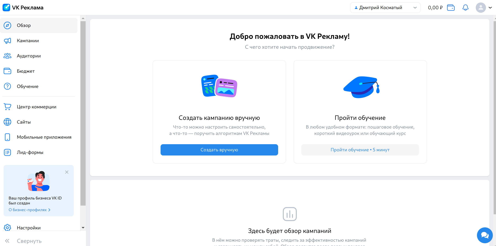
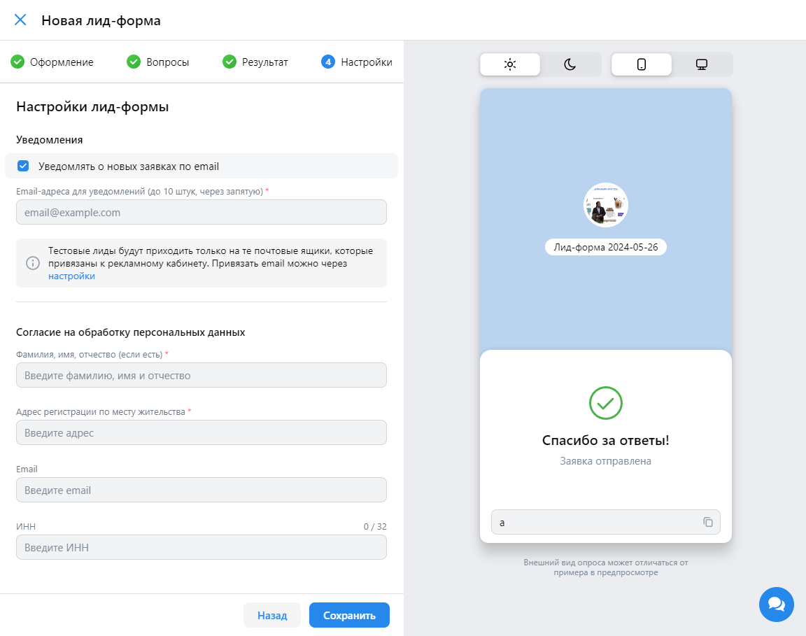

# Главная страница(неавторизированный пользователь)
ссылка: https://ads.vk.com

## Карусель 
- При нажатии на серую кнопку слайд меняется.

- При нажатии на кнопку "Получить бонус" происходит редирект на страницу https://ads.vk.com/promo/firstbonus с заголовком "Прибавляем 10 000₽ к бюджету"
## Кейсы компаний

- При нажатии на кейс происходит переходит редирект на https://ads.vk.com/cases/... с заголовком "Кейсы"
- При нажатии на "Смотреть все" происходит редирект на https://ads.vk.com/cases с заголовком "Кейсы"
## Обучающие вебинары

- При нажатии на кнопку "Подробнее" происходит редирект на https://ads.vk.com/events с заголовком Мероприятия
# Навбар(неавторизированный пользователь)

- При нажатии на значок "VK Реклама", происходит редирект на https://ads.vk.com/ с заголовком "Кейсы"
- При нажатии на кнопку "Новости" происходит редирект на https://ads.vk.com/news с заголовком "Новости"
- При нажатии на кнопку "Обучение" появляется выпадающий список: "Полезные материалы", "Мероприятия", "Видеокурсы", "Сертификация".
- При нажатии на кнопку "Кейсы" происходит редирект на https://ads.vk.com/cases с заголовком "Кейсы"
- При нажатии на кнопку "Форум идей" происходит редирект на https://ads.vk.com/upvote с заголовком "Форум идей"
- При нажатии на кнопку "Монетизация" происходит редирект на https://ads.vk.com/partner с заголовком "Зарабатывайте на вашем контенте"
- При нажатии на кнопку "Справку" происходит редирект на https://ads.vk.com/help  с заголовком "Справка"
- При нажатии на кнопку "Перейти в кабинет" происходит редирект на форму для входа, если не зарегистрированный, если зарегистрированные открывается начальная страница кабинета https://ads.vk.com/hq/overview

# Сайты (авторизированный пользователь)
ссылка: https://ads.vk.com/hq/pixels

## Форма добавления пикселя
- при нажатии на кнопку "Добавить пиксель" открывается форма Добавления сайта

- При вводе в форме некорректного url выводится ошибка 

- При вводе корректного пикселя выводится "Нашли пиксели, привязанные к сайту"

- При нажатии на кнопку "ID пикселя"  появляются поля для ввода id пикселя и email владельца

## Форма "Нашли пиксели"
- При создании на форме "Нашли пиксели, привязанные к сайту" открывается "Создан ID пикселя ..."

- При нажатии на кнопку "..." открывается выпадающий список: "Переменовать", "Удалить".

- При нажатии на кнопку "Удалить" открывается форма с предупреждением.

- При нажатии в "Удаление пикселя" на кнопку "Удалить" появляется текст "Нет привязанных пикселей трекинга" 
- При нажатии на кноку отмена в форме "Удаление пикселя" домен сайта остается в списке
- При нажатии на кнопку "Переменовать" открывается форма 
- При вводе нового, названия в форме для Переменования, он меняет своё название на странице.
- Поиск. При вводе несуществующего "Ничего  не найдено" 
- Поиск. При вводе существующего значения он появляется на странице 

## Лид форма
### Страница оформление

- При загрузке логотипа появляется кнопка заменить
- При нажатии на кнопки стили меняется стиль формы справа
- При нажатии на кнопку смены темы форма меняет свой стиль
- При смены версии на десктопную, она меняет свой стиль
- При корректном заполнении всех полей и нажатии на кнопку "Продолжить" отрисовывается страница "Вопросы"

### Вопросы

- При добавлении контактной информации, она добавляется в форму
- При удалении контактной информации, она удаляется из формы
- При добавлении вопроса, он добавляется к форме
- При нажатии на кнопку продолжить, отрисовывается страница "Результаты".
### Результаты

- При нажатии на добавить сайт и ввода текста в форме, появляется кнопка переход на сайт
- При нажатии на кнопку добавить номер и ввода текста  в форме, появляется кнопка позвонить
- При нажатии на кнопку промокод и ввода текста, в форме появляется текст с промокодом.
- При нажатии на кнопку продолжить отрисовывается страница "Настройки".
### Настройка

- При нажатии на чекбокс в уведомлениях, появляется поле для ввода email

При вводе данных лид-форма отображается

### Поиск
- При вводе существующей формы она отображается
- При вводе несуществующей появляется текст "Ничего не нашлось"
### Редактирование
- При нажатии на кнопку редактирование открывается форма с "Редактирование лид-формы"
### Удаление
- При удалении лид-формы она исчезает на окне
- При нажатии на кнопку "В архиве" появляется удаленная лид-форма
