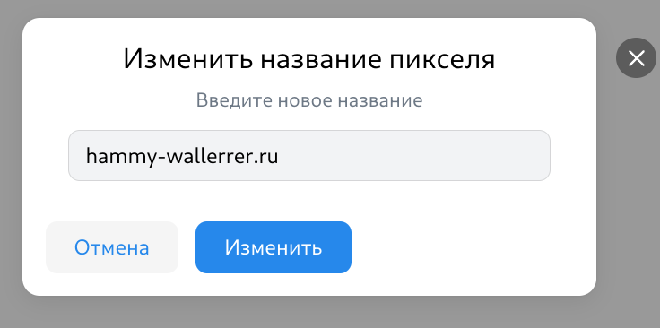

# Главная страница(неавторизированный пользователь)
ссылка: https://ads.vk.com

## Карусель 
- При нажатии на серую кнопку слайд меняется.

- При нажатии на кнопку "Получить бонус" происходит редирект на страницу https://ads.vk.com/promo/firstbonus
- Со временем появляется новый слайд.
## Кейсы компаний

- При наведении на изображение оно увеличивается.
- При нажатии на кейс происходит переходит редирект на https://ads.vk.com/cases/... 
- При нажатии на "Смотреть все" происходит редирект на https://ads.vk.com/cases 
## Обучающие вебинары

- При нажатии на кнопку "Подробнее" происходит редирект на https://ads.vk.com/events
# Навбар(неавторизированный пользователь)

- При нажатии на значок "VK Реклама", происходит редирект на https://ads.vk.com/
- При нажатии на кнопку "Новости" происходит редирект на https://ads.vk.com/news
- При нажатии на кнопку "Обучение" появляется выпадающий список: "Полезные материалы", "Мероприятия", "Видеокурсы", "Сертификация".
- При нажатии на кнопку "Кейсы" происходит редирект на https://ads.vk.com/cases
- При нажатии на кнопку "Форум идей" происходит редирект на https://ads.vk.com/upvote
- При нажатии на кнопку "Монетизация" происходит редирект на https://ads.vk.com/partner
- При нажатии на кнопку "Справку" происходит редирект на https://ads.vk.com/help
- При нажатии на кнопку "Перейти в кабинет" происходит редирект на форму для входа, если не зарегистрированный, если зарегистрированные открывается начальная страница кабинета https://ads.vk.com/hq/overview

# Авторизация
- Если нажать на ссылку "Узнать больше о VK ID" происходит редирект на страницу https://id.vk.com/promo
- Пока пользователь не ввёл значение в поле для логина, кнопка продолжить будет неактивна
- Если в поле для ввода логина и email ввести некорректное значение и нажать на кнопку продолжить появится ошибка "Аккаунт не найдет"

- При нажатии на значок с qr-code, должен сгенерироваться qr-code для входа
- При вводе правильного логина появлятся форма для ввода пароля
- Если в форме для ввода пароля ввести неправильный пароль выдаст ошибку

- Если в форме пароля ввести корректный пароль и нажать "Продолжить", должен появится текст "Введите код из SMS"

# Сайты (авторизированный пользователь)
ссылка: https://ads.vk.com/hq/pixels

- при нажатии на кнопку "Добавить пиксель" открывается форма Добавления сайта

- При вводе в форме некорректного url выводится ошибка 
- При вводе корректного пикселя выводится "Нашли пиксели, привязанные к сайту"

- При создании на форме "Нашли пиксели, привязанные к сайту" открывается "Создан ID пикселя ..."

- При нажатии на кнопку "..." открывается выпадающий список: "Переменовать", "Удалить".

- При нажатии на кнопку "Удалить" открывается форма с предупреждением.

- При нажатии в "Удаление пикселя" на кнопку "Удалить" появляется текст "Нет привязанных пикселей трекинга" 
- При нажатии на кноку отмена в форме "Удаление пикселя" домен сайта остается в списке
- При нажатии на кнопку "Переменовать" открывается форма 
- При вводе нового, названия в форме для Переменования, он меняет своё название на странице.
- Поиск. При вводе несуществующего "Ничего  не найдено" 
- Поиск. При вводе существующего значения он появляется на странице 